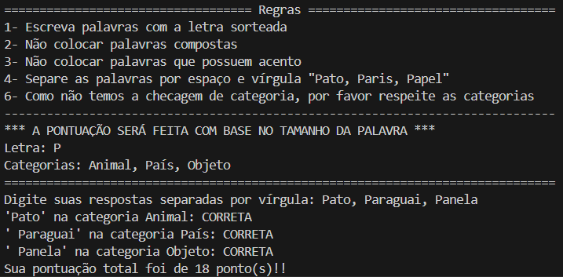

# Este é o README do trabalho da matéria "Sistemas Distribuídos e Tolerância de Falhas"

O trabalho tem como objetivo compreender os princípios da construção de programas distribuídos.

O trabalho consiste no desenvolvimento de um jogo com implementação distribuída. O jogo contemplar a participação de pelo menos 2 participantes em computadores diferentes.

### O **documento** contém:
- Descrição do jogo
- Arquitetura utilizada na implementação
- Como foi estruturada a solução do sistema distribuído
- Funcionamento do protocolo com explicação das mensagens trocadas
- Explicação de como compilar e executar o programa
- Prints de tela mostrando o funcionamento do programa

# Tela do Jogo

### Baseado no adedonha original, fizemos um jogo singleplayer no qual o usuário recebe uma letra e algumas categorias e tem que inserir palavras que iniciem com a letra e respeitem a categoria recebida. Após inserir as palavras, ao finalizar a rodada o usuário vai receber sua pontuação baseada no tamanho das palavras inseridas.

